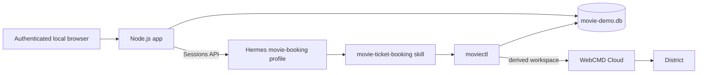

# Build a Hermes Movie-Ticket Booking Assistant

This guide combines a local web app, one dedicated Hermes profile, and hosted
WebCMD browser sessions. The app owns users and booking state. Hermes owns the
conversation. WebCMD owns District browser state. District owns payment and is
the only source of booking confirmation.

The complete runnable source is in
[`examples/movie-ticket-booking`](https://github.com/agentrhq/webcmd/tree/main/examples/movie-ticket-booking).

<Warning>
  This checkout does not make the complete hosted path live. District
  `booking-status` works in WebCMD Cloud only after this WebCMD package is
  published and `webcmd-cloud` upgrades and deploys that released version.
  Until that release gate is complete, do not present the current hosted flow
  as end-to-end or provider-verified.
</Warning>

## Architecture



The browser receives only app data and an HTTP-only login cookie. The backend
keeps the Hermes API key, Hermes session keys, WebCMD identity, and SQLite path
server-side.

## Identity and isolation

The identifiers deliberately do different jobs:

| Identifier | Scope | Purpose |
| --- | --- | --- |
| App user UUID | Local SQLite | Owns login, preferences, conversations, and booking attempts |
| `movie-demo:user:<uuid>` | Stable per app user | Hermes memory and trusted `moviectl` identity |
| Hermes session ID | One conversation | Transcript resume and New chat |
| Hashed WebCMD workspace | Stable per app user | Isolates hosted District cookies and browser state |

The backend creates the stable Hermes key; the frontend cannot submit one.
`moviectl` accepts only that key shape and derives
`movie_` plus the first 32 hexadecimal characters of its SHA-256 hash. It fixes
the hosted browser profile to `district-default` and rejects model-supplied
workspace, profile, trace, and output-format overrides.

Each authenticated user has one in-memory FIFO. The queue covers the entire
Hermes request and response, so two chats for one user cannot race the same
District workspace or booking state. Different users can proceed concurrently.

## Persistence ownership

The local SQLite database owns five tables: users, hashed login sessions,
conversation-to-Hermes mappings, preferences, and booking attempts. Every
conversation and booking query includes the authenticated app user ID.

Hermes keeps transcripts in the dedicated profile's own state. WebCMD Cloud
keeps District cookies and login state in the derived hosted workspace.
Passwords, raw login tokens, District credentials, OTPs, browser cookies,
payment details, and payment links are not stored as booking-history fields.

## Set up the demo

You need Node.js 22.5 or newer, a configured Hermes Agent installation, WebCMD,
a WebCMD Cloud account, and `openssl`. Run these commands from the WebCMD
repository root.

### 1. Select hosted WebCMD

```bash
webcmd setup
```

Choose `hosted` and enter the Cloud API key at the prompt. See
[Local or Cloud](/local-or-cloud) for the mode boundary and
[Authentication and Profiles](/authentication-and-profiles) for hosted
workspace and sign-in behavior.

### 2. Install the app and profile

```bash
npm --prefix examples/movie-ticket-booking install
hermes profile create movie-booking --clone
cp examples/movie-ticket-booking/hermes/SOUL.md ~/.hermes/profiles/movie-booking/SOUL.md
mkdir -p ~/.hermes/profiles/movie-booking/skills
cp -R examples/movie-ticket-booking/hermes/skills/movie-ticket-booking ~/.hermes/profiles/movie-booking/skills/
```

The clone reuses the active profile's model configuration and credentials while
giving the demo fresh Hermes sessions and memory.

Configure the profile's API server and the shared absolute paths:

```bash
export MOVIE_DEMO_ROOT="$(pwd -P)/examples/movie-ticket-booking"
export MOVIE_DEMO_DB_PATH="$MOVIE_DEMO_ROOT/movie-demo.db"

hermes -p movie-booking config set API_SERVER_ENABLED true
hermes -p movie-booking config set API_SERVER_KEY "$(openssl rand -hex 32)"
hermes -p movie-booking config set --force MOVIE_DEMO_ROOT "$MOVIE_DEMO_ROOT"
hermes -p movie-booking config set --force MOVIE_DEMO_DB_PATH "$MOVIE_DEMO_DB_PATH"
```

Hermes stores the generated bearer key in the named profile's private `.env`.
Do not paste it into the repository, browser, skill, or chat.

### 3. Start Hermes

In terminal 1:

```bash
hermes -p movie-booking gateway run
```

This is the current Hermes CLI path for a named profile's foreground gateway.
The enabled API-server adapter exposes the authenticated Sessions API on
`http://127.0.0.1:8642`. Stop it later with `Ctrl-C`.

### 4. Start the local app

In terminal 2, from the repository root:

```bash
export MOVIE_DEMO_ROOT="$(pwd -P)/examples/movie-ticket-booking"
export MOVIE_DEMO_DB_PATH="$MOVIE_DEMO_ROOT/movie-demo.db"
export HERMES_API_URL="http://127.0.0.1:8642"
export API_SERVER_KEY="$(hermes -p movie-booking config get API_SERVER_KEY)"
export PORT=3000

npm --prefix "$MOVIE_DEMO_ROOT" run dev
```

Open `http://127.0.0.1:3000`. Press `Ctrl-C` in the app terminal to stop the
app, then press `Ctrl-C` in the Hermes terminal.

## How the skill stays narrow

The supplied `SOUL.md` requires the `movie-ticket-booking` skill for every
movie request. The skill gathers only missing requirements, recommends a short
list of live screenings and adjacent seats, displays an exact checkout
summary, and waits for explicit confirmation.

The skill never calls WebCMD directly. It invokes:

```text
npm --prefix "$MOVIE_DEMO_ROOT" run moviectl -- ...
```

`moviectl` validates arguments, derives identity, owns SQLite transitions, and
spawns `webcmd` with an argument array. The model cannot choose a workspace or
change the `district-default` browser profile.

## End-to-end booking flow

1. Register or log in. The app resumes the most recently used conversation, or
   New chat creates a fresh Hermes session without changing user identity.
2. Ask for a movie, city, date, and ticket count. Hermes reads saved
   preferences and asks only for missing details.
3. Hermes uses District search and showtimes, then recommends current cinema,
   time, format, price, and show URL options.
4. After you choose a screening, Hermes fetches live seats and presents exact
   adjacent seat sets.
5. `prepare-checkout` writes the chosen movie, cinema, time, seats, and amount
   as `awaiting_confirmation`.
6. Hermes repeats that exact summary and waits for an explicit yes.
7. One checkout call moves the attempt to `pending_payment` and returns
   District's payment link. Complete login and payment only in the hosted
   browser handoff.
8. When you say you paid, Hermes calls `booking-status`; your statement alone
   is never evidence.
9. Only a District `confirmed` result with a non-empty booking reference moves
   the SQLite attempt to `confirmed`.

The app never collects card data, payment credentials, provider passwords, or
OTPs.

## Failure safety

| Failure | Safe next action |
| --- | --- |
| District requires login before checkout | Complete the hosted login handoff, show the summary again, get a fresh yes, then run checkout once |
| Showtime or seats became stale | Expire the old attempt, refresh live options, prepare a new attempt, and confirm again |
| Payment is pending | Keep `pending_payment`; check status only when the user asks or reports payment |
| Payment failed or expired | Persist that typed result and offer a fresh search |
| Checkout result is ambiguous | Keep the attempt pending and reconcile with status; never retry checkout blindly |
| Service or provider response is invalid | Return a safe typed error without leaking response bodies or credentials |

An unresolved pending payment blocks another checkout for that user. This
favors avoiding a duplicate purchase over optimistic retry.

## Try user isolation

Register two local accounts. Each gets a different app UUID, Hermes session key,
and derived WebCMD workspace, while both use the same Hermes profile. A new
login cookie or New chat does not change that user's stable workspace.

Do not use this check as proof that the current Cloud deployment contains
`booking-status`; the hosted release gate at the top of this guide still
applies.

## Local-demo limits

- The app and Hermes run locally; this guide does not deploy either service.
- Per-user queues are process-local and disappear on restart.
- The shared Hermes profile plus terminal skill is a behavioral boundary, not
  a sandbox against a malicious model.
- SQLite and one app process are not a horizontal-scaling design.
- The hosted payment link may remain in the user's Hermes transcript, although
  it is excluded from booking-history records.
- A production service should expose a dedicated narrow Hermes tool, use
  durable distributed coordination, and apply its own deployment and secret
  controls.

## Verify local code

```bash
npm --prefix examples/movie-ticket-booking test
npm --prefix examples/movie-ticket-booking run typecheck
```

These checks use fake WebCMD behavior; they do not perform a live purchase or
prove that Cloud has deployed this branch.
