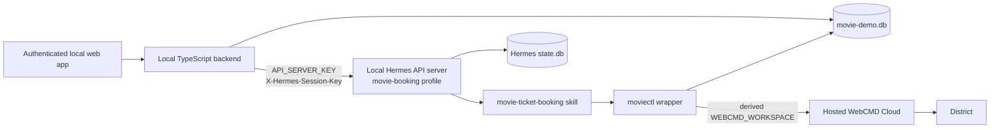
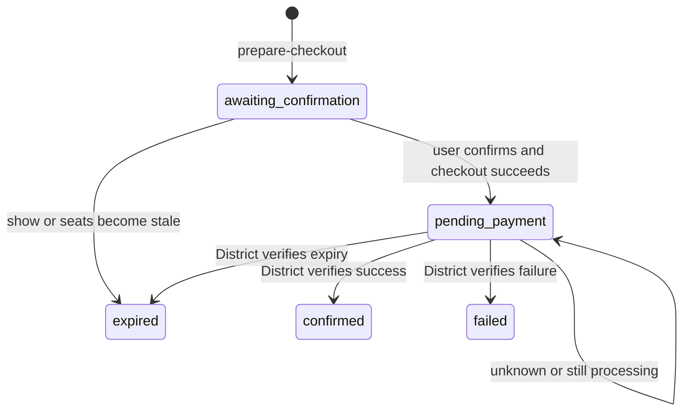

# Hermes Movie Ticket Booking Demo Design

**Status:** Approved design
**Date:** 2026-07-28
**Primary repository:** `/Users/ankitranjan/Work/webcmd`

## 1. Outcome

Build a local, authenticated movie-ticket booking web app that uses a dedicated
local Hermes Agent profile for the conversation and hosted WebCMD Cloud for
District browser execution.

The user can:

1. Sign up or log in to the local app.
2. Ask for a movie in natural language.
3. Compare District cinemas, showtimes, formats, prices, and seats.
4. Confirm an exact screening and seat set.
5. Open a hosted WebCMD handoff link and complete payment themselves.
6. Ask the app to verify the payment.
7. See only provider-verified bookings in confirmed booking history.

The implementation is also the source material for a public WebCMD guide. The
guide must explain the architecture, Hermes skill, user isolation, hosted
browser handoff, and complete booking flow.

## 2. Scope

### Included

- A local TypeScript/Node.js web app with an authenticated chat.
- Local SQLite persistence for app users, sessions, preferences,
  conversations, and booking attempts.
- One local Hermes profile named `movie-booking`, shared by all app users.
- A Hermes `movie-ticket-booking` skill that owns the conversational workflow.
- A small deterministic `moviectl` wrapper used by the skill.
- One stable Hermes session key and one hosted WebCMD workspace per app user.
- District search, showtimes, seats, login handoff, checkout, payment handoff,
  and booking-status verification.
- Resume-last-chat behavior plus a New chat action.
- Visible booking history with pending, confirmed, failed, and expired states.
- A website guide and checked-in runnable example.

### Excluded

- BookMyShow or cross-provider comparison.
- Hosting the demo app or Hermes.
- Collecting card details or processing payment inside the app.
- Storing District passwords, OTPs, cookies, card data, or payment credentials.
- Automatic purchase without explicit user confirmation.
- Production-grade agent sandboxing, distributed sessions, or horizontal
  scaling.

## 3. System Boundary



The local backend is the user-authentication boundary. The browser never
receives the Hermes API key or WebCMD credentials and never chooses a Hermes
session key, Hermes session ID belonging to another user, or WebCMD workspace.

## 4. Components

### 4.1 Local web app

Use Node.js 22.5 or newer so the example can use the built-in `node:sqlite`
module. The app is a single Node.js process with the smallest readable
TypeScript implementation:

- Node's HTTP, crypto, fetch, and SQLite facilities.
- Static HTML and CSS served by the backend, with lightweight browser
  JavaScript.
- No frontend framework, ORM, external auth service, or queue.
- Synchronous Hermes chat is sufficient for the first demo; streaming is not a
  prerequisite.

The app provides:

- Register, login, and logout.
- HTTP-only, SameSite login cookies.
- Chat list, resume-last-chat, New chat, and transcript display.
- User preference editing.
- Booking-history display.
- A payment-handoff link shown only inside the authenticated chat.

### 4.2 Hermes profile

All app users share one dedicated `movie-booking` Hermes profile. A Hermes
profile represents agent configuration, skills, model settings, allowed
toolsets, and `state.db`; it is not an app-user account.

The profile contains:

- The `movie-ticket-booking` skill.
- Only the toolsets required to run the trusted local wrapper.
- Hermes API-server configuration.
- A backend-only `API_SERVER_KEY`.
- Persistent, profile-scoped `state.db`.

No Hermes core or third-party product integration belongs in the
`hermes-agent` repository for this demo. The example owns the skill source and
documents how to install it into the local profile.

### 4.3 `movie-ticket-booking` skill

The skill owns decisions that benefit from an agent:

- Gathering missing movie, city, date, party-size, budget, language, and format
  requirements.
- Ranking cinemas and showtimes.
- Recommending two or three adjacent seat combinations.
- Presenting exact booking summaries.
- Waiting for explicit confirmation before checkout.
- Explaining typed failures and safe recovery.

The skill must not:

- Call raw WebCMD with a user- or model-selected workspace.
- Treat an “I've paid” message as proof of payment.
- Retry checkout automatically.
- Fabricate listings, availability, prices, or confirmation.
- Store or request provider credentials in chat.

### 4.4 `moviectl` wrapper

`moviectl` is a small TypeScript command executed locally by Hermes. It is the
deterministic boundary for user identity, input validation, app persistence,
and WebCMD execution.

It:

- Reads identity only from `HERMES_SESSION_KEY`.
- Rejects a missing or malformed session key.
- Resolves the current app user from the stable key.
- Derives an opaque WebCMD workspace and accepts no workspace argument.
- Uses the fixed profile name `district-default` inside that workspace.
- Invokes WebCMD with argument arrays rather than a shell-built command.
- Uses hosted WebCMD configuration and server-side credentials.
- Returns a stable JSON success/error envelope.
- Writes booking state changes atomically to `movie-demo.db`.

The local process supplies the absolute database location through
`MOVIE_DEMO_DB_PATH`; the agent cannot override it per command.

Minimal command surface:

```text
moviectl profile get
moviectl profile update <validated preference fields>
moviectl district search <movie, city, date>
moviectl district showtimes <movie, city, date>
moviectl district login
moviectl district seats <show identifier>
moviectl district prepare-checkout <show, seats, quoted amount>
moviectl district checkout <attempt identifier>
moviectl district booking-status <attempt identifier>
```

`prepare-checkout` records the exact selection as `awaiting_confirmation`.
After the user confirms that summary, `checkout` validates that the attempt is
still current, prevents a second unresolved checkout for the same selection,
and moves it to `pending_payment`. `booking-status` is the only command allowed
to move an attempt to `confirmed`.

For this local demo, the skill plus wrapper is a behavioral and identity
boundary, not a hard sandbox against a malicious model. A public production
service would replace broad terminal access with a dedicated narrow Hermes
tool.

### 4.5 Hosted WebCMD Cloud and District

WebCMD Cloud owns the browser process and District session state. Each app user
receives one opaque workspace and one persistent District browser profile
inside that workspace.

The current District surface already provides discovery, authentication,
seat-selection, and checkout-to-payment-handoff behavior. The implementation
must add or prove a typed `booking-status` command before the demo can claim
end-to-end completion.

The hosted deployment must run a WebCMD build that contains every command used
by the guide. Cloud health alone is insufficient; the acceptance check is a
real hosted District flow.

## 5. Identity and Session Model

Three identifiers have different jobs:

| Identifier | Owner | Lifetime | Purpose |
| --- | --- | --- | --- |
| App user ID | `movie-demo.db` | Permanent | Customer identity |
| `X-Hermes-Session-Key` | Derived by backend | Stable across logins and chats | User-scoped Hermes memory and wrapper identity |
| Hermes session ID | Hermes plus app mapping | One chat transcript | Resume or create a conversation |
| Login cookie | Local app | Rotating, expiring | Browser authentication |
| WebCMD workspace | Derived by wrapper | Stable across logins and chats | District browser-state isolation |

The backend derives:

```text
X-Hermes-Session-Key = "movie-demo:user:" + app_user_uuid
WebCMD workspace = "movie_" + first_32_hex_chars(sha256(session_key))
```

The frontend cannot submit either value. On every request the backend resolves
the authenticated app user, supplies the stable Hermes key, verifies ownership
of the requested app conversation, and then supplies its Hermes session ID.

A returning user receives a new login cookie but the same app user ID, Hermes
session key, and WebCMD workspace. New chat creates a new Hermes session ID
without changing the stable user identity.

The backend must not expose Hermes session-list or arbitrary session-resource
endpoints directly to the browser.

## 6. Persistence

### 6.1 App database

Use one local SQLite database named `movie-demo.db` with foreign keys enabled
and these tables:

| Table | Essential fields |
| --- | --- |
| `users` | `id`, unique normalized `email`, `password_hash`, `created_at` |
| `auth_sessions` | hashed `token`, `user_id`, `expires_at`, `created_at` |
| `conversations` | `id`, `user_id`, unique `hermes_session_id`, `title`, timestamps |
| `user_preferences` | `user_id`, city, languages, formats, seat position, budget, `updated_at` |
| `booking_attempts` | `id`, `user_id`, conversation, selection, amount, status, District reference, timestamps |

Passwords use Node's `crypto.scrypt` with a per-user random salt. Login tokens
are random, stored only as hashes, expired by timestamp, and delivered in an
HTTP-only SameSite cookie.

`booking_attempts` stores the movie, cinema, screening, selected seats, quoted
amount, state, and District booking reference. It does not store credentials,
cookies, card data, OTPs, or the hosted payment link as a booking-history
field.

### 6.2 Hermes state

Hermes keeps conversation transcripts in the dedicated profile's `state.db`.
The app database stores only the ownership mapping and display metadata for
each Hermes session.

### 6.3 WebCMD state

District cookies and login state remain in the user's hosted WebCMD browser
profile. They are never copied into the app database, skill, prompt, logs, or
fixtures.

## 7. Booking Lifecycle

1. The authenticated user opens their most recent chat or creates a new one.
2. The app sends the message to the owned Hermes session with the user's stable
   `X-Hermes-Session-Key`.
3. Hermes reads stored preferences and asks only for missing requirements.
4. Hermes searches District and compares cinemas, showtimes, formats, and
   prices.
5. The user selects a screening.
6. If District authentication is required, Hermes returns the hosted WebCMD
   login handoff and pauses.
7. Hermes fetches live seats and recommends two or three adjacent seat sets
   with class, position, and total price.
8. `prepare-checkout` records the exact selection.
9. Hermes displays provider, movie, cinema, time, seats, and payable amount and
   waits for explicit confirmation.
10. `checkout` starts the District checkout and returns the hosted payment
    handoff link.
11. The user completes payment in that hosted browser and clicks **I've paid**
    in the local app.
12. Hermes calls `booking-status`.
13. Only a typed District success response with a booking reference changes
    the attempt to `confirmed` and places it in confirmed history.

## 8. Booking State Machine



An unresolved `pending_payment` attempt blocks automatic duplicate checkout.
The next action is always `booking-status`, not another purchase attempt.

## 9. Failure Handling

| Condition | Required behavior |
| --- | --- |
| District login required | Return hosted login handoff, pause, and resume the interrupted step afterward |
| Showtime disappeared | Return to fresh showtimes and ask the user to choose again |
| Seats changed | Refresh seats, recommend again, and require confirmation again |
| Checkout timed out or returned an ambiguous result | Keep the attempt pending and run status before any new checkout |
| Payment remains pending | Keep it pending and allow an explicit status recheck |
| Payment failed or expired | Persist the typed result and offer a fresh search; never silently retry |
| District/WebCMD unavailable | Return a typed service error and preserve the last safe state |
| Invalid or missing Hermes session key | Reject the wrapper command |
| Conversation does not belong to user | Return 404/forbidden without contacting Hermes |

Read-only discovery calls may retry with a small bound. Checkout never retries
automatically.

The hosted handoff URL is ephemeral and displayed only to the authenticated
user. It may appear in that user's local Hermes transcript, but it is not
copied into durable booking-history fields. A production service would need a
stricter one-time-link mechanism.

## 10. User Interface

The demo needs five small surfaces:

1. Register/login form.
2. Chat screen with conversation list and New chat.
3. Recommendation messages with an explicit confirm/cancel chat prompt.
4. User profile/preferences screen.
5. Booking-history screen grouped by pending, confirmed, and failed/expired.

On login, the app opens the most recently used conversation. New chat creates a
new app conversation and Hermes session while retaining preferences and the
District browser profile.

The UI does not need a full seat-map renderer in the first version. Hermes can
present the two or three recommended seat combinations as accessible text
options, because WebCMD performs the actual selection.

## 11. Verification

Use the smallest checks that protect the important boundaries:

### Automated

- Two app users derive different workspaces.
- The same app user derives the same Hermes key and workspace after re-login.
- A user cannot open another user's conversation or booking.
- Passwords and login tokens are never stored in plaintext.
- Missing or malformed `HERMES_SESSION_KEY` is rejected.
- `confirmed` cannot be written without a typed District-success result.
- An unresolved checkout cannot create a duplicate attempt.
- A changed show or seat selection returns to confirmation.
- Skill scenarios cover missing requirements, recommendation, seat
  confirmation, login handoff, payment handoff, and status verification.

Use Node's built-in test runner and a fake WebCMD executable for deterministic
wrapper tests. Do not add a test framework solely for the example.

### Manual hosted smoke test

1. Verify the WebCMD Cloud health and authenticated account endpoints.
2. Run a real hosted District search and showtime lookup.
3. Exercise District login handoff if required.
4. Fetch real seat availability and prepare an exact selection.
5. Confirm checkout produces a usable hosted payment link.
6. Let a human perform payment.
7. Verify `booking-status` returns the booking and the local app shows it in
   confirmed history.
8. Repeat the identity check with a second local app user.

## 12. Repository Ownership and Delivery Order

This design crosses three runtime systems but does not require Hermes core
changes.

### Phase 1: District end-to-end capability

**Repository:** `/Users/ankitranjan/Work/webcmd`

- Add or prove District `booking-status`.
- Add typed errors needed by the lifecycle.
- Verify search, showtimes, login, seats, checkout, and status locally.

**Repository:** `/Users/ankitranjan/Work/webcmd-cloud`

- Deploy a compatible WebCMD build.
- Verify workspace/profile isolation and hosted payment handoff.
- Run the hosted District smoke path.

This phase blocks the product demo because payment cannot be called complete
without provider verification.

### Phase 2: Local app and Hermes skill

**Repository:** `/Users/ankitranjan/Work/webcmd`

- Add the runnable example under `examples/movie-ticket-booking/`.
- Add the local TypeScript app, SQLite schema, Hermes skill source, and
  `moviectl`.
- Document local profile installation and process startup.
- Verify two-user isolation and the complete booking state machine.

**Repository:** `/Users/ankitranjan/Work/hermes-agent`

- No product-specific source changes.
- Run the existing Hermes API server with the dedicated local profile.

### Phase 3: Public guide

**Repository:** `/Users/ankitranjan/Work/webcmd`

- Add `docs/guides/movie-ticket-booking.mdx`.
- Add a Guides navigation group in `docs/docs.json`.
- Explain prerequisites, hosted WebCMD setup, Hermes profile setup, the skill
  contract, identity mapping, app startup, the end-to-end walkthrough, failure
  handling, and demo limitations.
- Keep guide snippets synchronized with the checked-in example instead of
  duplicating large source files in prose.

## 13. Guide Success Criteria

A reader starting with Node.js, Hermes Agent, and a WebCMD Cloud account can:

1. Configure hosted WebCMD.
2. Create the dedicated Hermes profile.
3. Install the supplied skill.
4. Start Hermes and the local web app.
5. Register two local users and observe isolated District sessions.
6. Complete one human-paid District booking.
7. See provider-verified confirmation in booking history.
8. Understand which parts are appropriate for a local demo and which require a
   stronger production boundary.

## 14. Product Acceptance Criteria

The demo is complete only when:

- BookMyShow is absent from product copy, code paths, skill behavior, and guide.
- Each authenticated app user maps to one stable Hermes key and one stable,
  isolated WebCMD workspace.
- Returning users resume their most recent chat and can create new chats.
- Hermes recommends District screening and adjacent-seat options from live
  data.
- Checkout occurs only after an exact user confirmation.
- Payment happens only through the hosted WebCMD handoff.
- The app never marks a booking confirmed based only on user input.
- District verification places the booking in visible confirmed history.
- District credentials, browser cookies, OTPs, card data, and payment
  credentials remain outside app and Hermes persistence.
- The checked-in example and public guide reproduce the same working flow.
